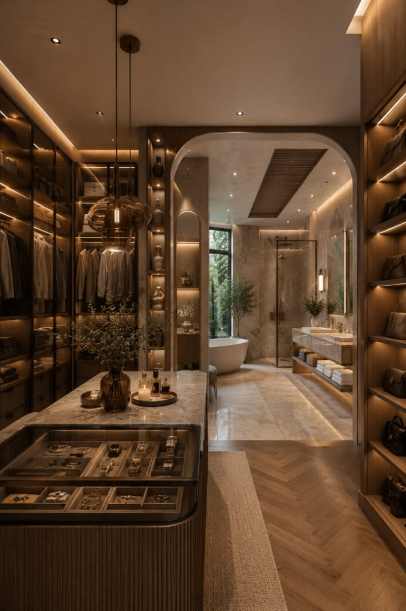

# Atelier & Co. — Bespoke Modular Wardrobe & Cabinet Maker

A premier digital showcase and client portal for bespoke luxury joinery, precision German-engineered modular wardrobes, Italian architectural kitchen cabinetry, and smart integrated storage solutions.



---

## 🌟 Key Features

- **Luxury Architectural Aesthetic**: Modern dark-mode palette, champagne gold accents, glassmorphic navigation, micro-interactions, and high-resolution bespoke photography.
- **Interactive 3D Studio / Wardrobe Configurator**: Dynamic modular wardrobe visualizer with finish selections, hardware toggles, and real-time layout adjustment.
- **Instant Project Cost Estimator**: Comprehensive multi-step calculation engine estimating costs across materials (Fluted Amber Glass, Matte PU Lacquer, Natural American Walnut, Smoked Eucalyptus), layout dimensions, and hardware suites (Blum / Hettich / Salice).
- **Client & Admin Dashboards**:
  - **Client Portal**: Track project phases, 3D render approvals, production milestones, material specifications, and direct atelier messaging.
  - **Admin Studio**: CRM pipeline, lead status management, quote generation, and production scheduling.
- **Bespoke Portfolio & Filterable Gallery**: Categorized showcases for Walk-in Wardrobes, Sliding Systems, Island Units, Alcove Joinery, and Luxury Kitchens.
- **Consultation & Private Viewing Booking Engine**: Multi-step booking modal for flagship studio consultations in London, New York, and Dubai.
- **Atelier Journal / Editorial**: In-depth design guides covering coplanar tracks, veneer care, attic storage geometry, and lacquer durability.

---

## 📁 Repository Structure

```text
Modular Wardrobe & Cabinet Maker/
├── assets/
│   ├── css/
│   │   └── styles.css          # Master stylesheet with luxury design system & responsive layout
│   ├── js/
│   │   └── main.js             # Interactive scripts, estimator, filters, modals, & mobile nav
│   ├── images/                 # Material textures, glass swatches, finishes
│   └── *.png, *.jpg, *.svg     # Curated high-resolution bespoke joinery photography & branding
├── index.html                  # Flagship Homepage with hero, configurator, & services
├── home-niche.html             # Specialized Walk-In Wardrobe Atelier landing page
├── about.html                  # Heritage, master craftsmen, workshop story, and certifications
├── services.html               # 6 core joinery specializations & specifications
├── service-details.html        # Deep dive into custom wardrobe engineering & hardware
├── products.html               # Modular wardrobe systems, dimensions, & finishes catalog
├── gallery.html                # Filterable project portfolio with lightbox previews
├── pricing.html                # Transparent luxury pricing tiers, packages, & instant estimator
├── process.html                # 5-step bespoke commissioning journey from survey to handover
├── contact.html                # Experience centers (Mayfair, Manhattan, DIFC) & inquiry form
├── blog.html                   # Joinery journals, architectural insights, and care guides
├── blog-details.html           # Featured architectural joinery article
├── client-dashboard.html       # Client portal for live project tracking & approvals
├── admin-dashboard.html        # Atelier studio management & CRM console
├── login.html & register.html  # Authentication portals
├── coming-soon.html            # Maintenance & teaser landing page
├── 404.html                    # Luxury custom error page
└── .gitignore                  # Git ignore definitions
```

---

## 🚀 Getting Started

Since the project is built with vanilla HTML5, CSS3, and modern JavaScript, no build step or node compilation is required.

### 1. Clone the repository
```bash
git clone https://github.com/moulekannan3004-crypto/Modular-Wardrobe-Cabinet-Maker.git
cd Modular-Wardrobe-Cabinet-Maker
```

### 2. Run locally
You can launch any static file server:

- **VS Code Live Server**: Right-click `index.html` and select **Open with Live Server**.
- **Python**:
  ```bash
  python -m http.server 8000
  ```
- **Node `serve` / `npx http-server`**:
  ```bash
  npx serve .
  ```

Open your browser at `http://localhost:8000`.

---

## 🛠️ Built With

- **HTML5**: Semantic, accessible markup.
- **CSS3**: Custom CSS variables, flexbox, CSS grid, and responsive media queries.
- **JavaScript (ES6+)**: Custom reactive interactions without heavy third-party framework overhead.
- **Google Fonts & Lucide Icons**: Clean typography and crisp vector iconography.

---

## 📄 License

Private repository / Portfolio work. All rights reserved.
